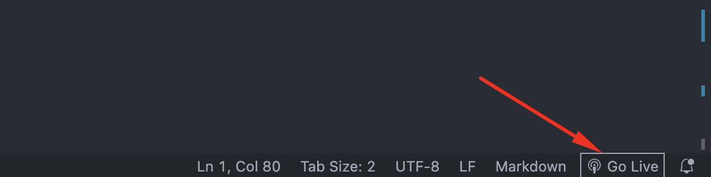
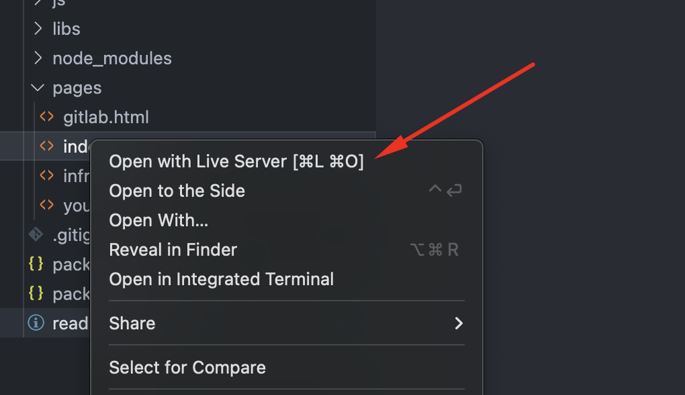

Для запуска потребуется поднятие внутреннего сервера через среду разработки VSC

Или через контекстное меню *pages/index.html* - Open with live Server

Навигация происходит через основной файл, в три дополнительных, разделенных по пунктам в компетенциях, при клике на изображение происходит открытие соответсвующей страницы.
Для возврата необходимо воспользоваться функцией *назад* (или *<* в окне браузера)
(*gitlab.html*, *youtrack.html*, *infra.html*)